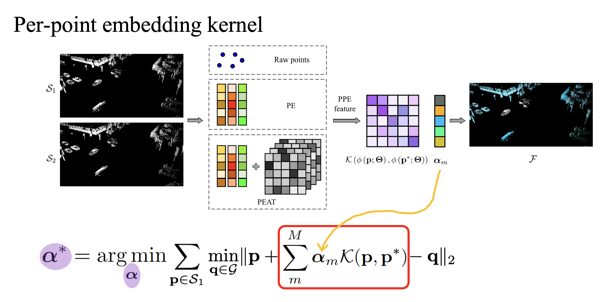

# Fast Kernel Scene Flow

[](https://opensource.org/licenses/MIT)

[Xueqian Li](https://lilac-lee.github.io/) and
[Simon Lucey](https://researchers.adelaide.edu.au/profile/simon.lucey).

arXiv link: https://arxiv.org/abs/2403.05896

This is the code implementation of Fast Kernel Scene Flow, a fast per-point embedding-based kernel method for scene flow estimation.


---



With input point cloud $\mathcal{S}_1$, $\mathcal{S}_2$, we could use different approaches to extract per-point features. 
For example: (a) Raw points, which treat original points as point features; 
(b) PE, which uses an RFF-based positional encoding to embed the input point to high-frequency features; 
(c) PEAT, which extracts learned point features using positional encoding and self-attention. 
A kernel function $\mathcal{K}$ is then employed to compute the similarity matrix between these two inputs based on their point features. 
Finally, a linear coefficient vector $\mathbf{\alpha}$ is optimized per sample to predict the final flow. 
Our model is compact and fast, with only $\mathbf{\alpha}$ being the learnable
parameter during runtime. 

---


### Prerequisites
This code is based on PyTorch implementation, and tested on PyTorch=1.12.0, Python=3.9.15 with CUDA 11.6. 

A simple installation is ```bash ./install.sh```.

For a detailed installation guide, please go to [requirements.yml](requirements.yml).


### Dataset
We directly use the datasets provided by [FastNSF](https://lilac-lee.github.io/FastNSF/). 
You may download datasets used in the paper from these links:

- [Argoverse](https://drive.google.com/file/d/1qyTaLz1_CTF3IB1gr3XpIiIDh6klQOA4/view?usp=sharing) (390MB)

- [Waymo Open](https://drive.google.com/file/d/1urONegaI6pS47bUv-Kw0nl0oGFzGfIl2/view?usp=sharing) (476MB)


---
### Running the code

- Argoverse scene flow dataset
    ```
    python kernel_flow.py --device cuda:0 --dataset_name argoverse --data_path <dataset_dir> --iters 1000 --earlystopping --early_patience 10 --early_min_delta 0.001 --kernel_grid --grid_factor 0.2 --model pe --weight_decay 0. --use_dt_loss --dt_grid_factor 10. --use_all_points --alpha_init_method same_as_linear --alpha_init_scaling 1. --reg_name l1 --reg_scaling 5. --epsilon 1e-7 --pe_type RFF --pe_dim 256 --pe_sigma 0.01 --log_sigma 10. --alpha_lr 0.008
    ```

- Waymo Open scene flow dataset
    ```
    python kernel_flow.py --device cuda:0 --dataset_name waymo --data_path <dataset_dir> --iters 1000 --earlystopping --early_patience 10 --early_min_delta 0.001 --kernel_grid --grid_factor 0.2 --model pe --weight_decay 0. --use_dt_loss --dt_grid_factor 10. --use_all_points --alpha_init_method same_as_linear --alpha_init_scaling 1. --reg_name l1 --reg_scaling 5. --epsilon 1e-7 --pe_type RFF --pe_dim 256 --pe_sigma 0.01 --log_sigma 10. --alpha_lr 0.008
    ```


---
### Acknowledgement

[Neural Scene Flow Prior](https://github.com/Lilac-Lee/Neural_Scene_Flow_Prior)

[Fast Neural Scene Flow](https://github.com/Lilac-Lee/FastNSF)

[FastGeodis: Fast Generalised Geodesic Distance Transform](https://github.com/masadcv/FastGeodis)

### Contributing

If you find the project useful for your research, you may cite,
```
@article{li2024fast,
  title={Fast Kernel Scene Flow},
  author={Li, Xueqian and Lucey, Simon},
  journal={arXiv preprint arXiv:2403.05896},
  year={2024}
}
```
